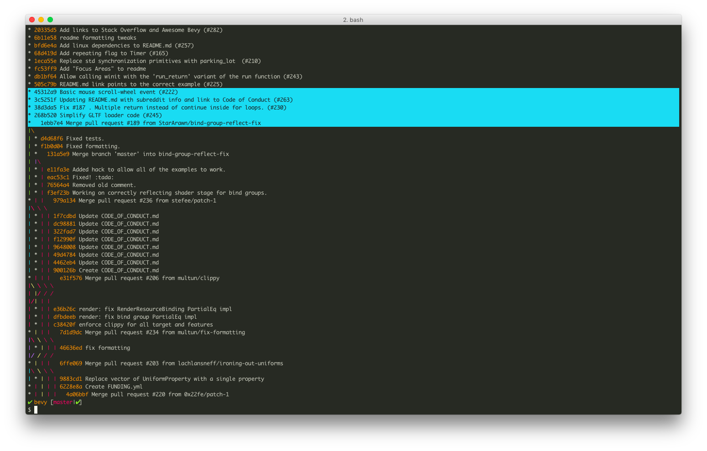
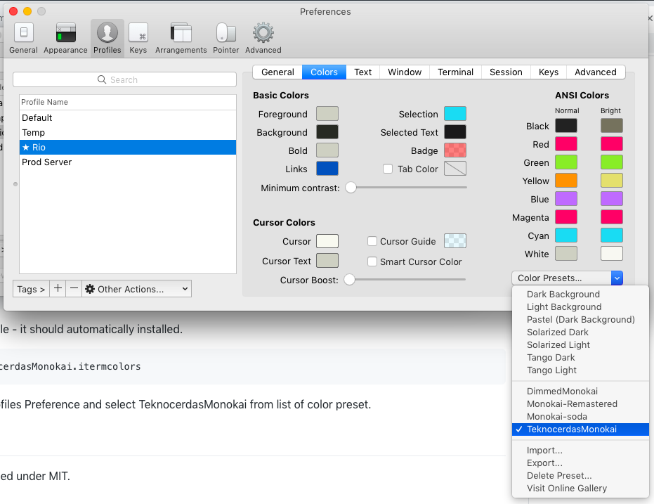

## TeknoCerdas Monokai

This is another alternative for iTerm2 (and iTerm) Monokai based theme. This one is based on Monokai Soda taken from [https://github.com/mbadolato/iTerm2-Color-Schemes/](https://github.com/mbadolato/iTerm2-Color-Schemes/).

What's the different from the Monokai Soda?

- Background color using RGB (40, 41, 35) similar which found in Sublime Text 3
- Selection text using Cyan color

The rest should be the same.

[](./screenshot.png)

## How to Install

Just download the `TeknocerdasMonokai.itermcolors` and open it in Finder. It should be automatically installed into iTerm2.

If you prefer command line, here's how to do it.

```
$ curl -O -L https://raw.githubusercontent.com/rioastamal/teknocerdas-monokai/master/TeknocerdasMonokai.itermcolors
```

Then open the file to install.

```
$ open TeknocerdasMonokai.itermcolors
```

Open iTerm2 Profiles Preference and select TeknocerdasMonokai from list of color preset.

[](./iterm2-profile.png)

## License

This file is licensed under MIT.
